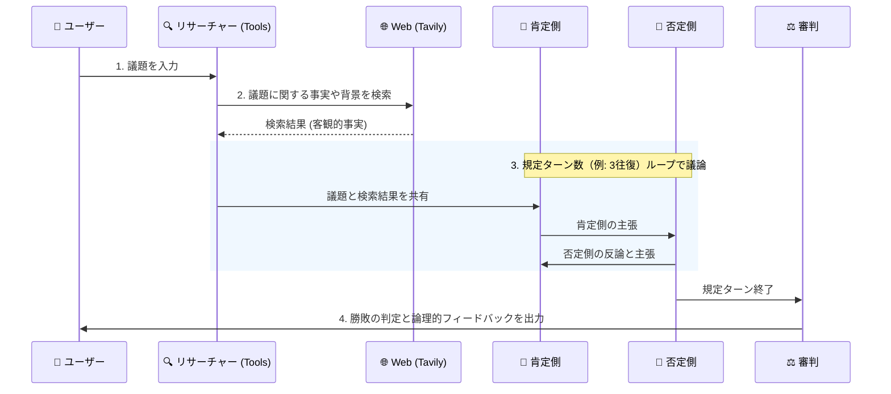
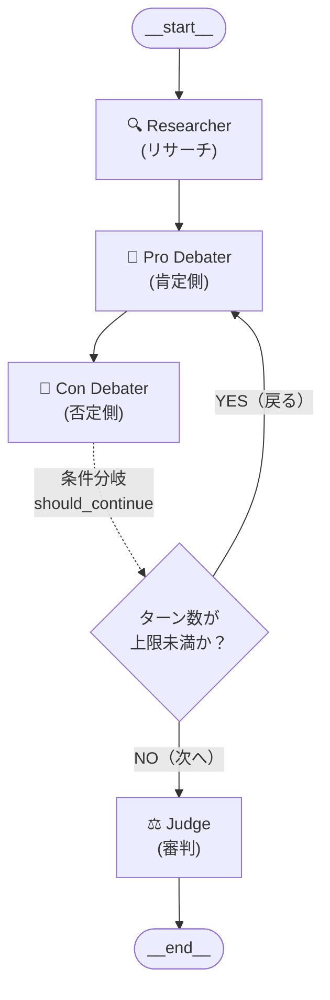

### アプリの概要
ユーザーが設定した議題に対して、「肯定側」と「否定側」のAIエージェントが自律的にディベートを行い、指定されたターン数で議論をし、最後に「審判」エージェントが勝敗とその判断理由を下すWebアプリケーションです。ハルシネーションをさせないために議論の元となるデータは`Tavily Search API`を使用して、web検索させるようにしています。

**▼ 処理フローのイメージ**



### 使用技術
- **エディタ**: Antigravity
- **言語**: Python 3
- **LLM構成**: LangChain, LangGraph
- **モデル**: OpenAI API (`gpt-4o-mini`)
- **Web検索**: Tavily Search API
- **フロントエンド UI**: Streamlit

## 💡 そもそも LangGraph とは？

LangGraph は、LangChain の開発チームが提供しているAIエージェントを簡単に構築するためのフレームワークです。
従来の LangChain（LCEL）では、一直線のタスク処理（入力 ➡️ LLM ➡️ 出力）は得意でしたが、「エラーが出たらもう一度調べてやり直す」「AとBのエージェントが対話する」といった **ループ（循環）や複雑な条件分岐** を簡潔に書くのが困難でした。

LangGraph はその名の通り、アプリケーションの処理フローを **グラフ（Graph）構造** として定義し、複数のエージェント（LLM）同士のやり取りや状態の流れを簡単に、かつ柔軟に制御できるように設計されています。

## 🏛 アーキテクチャ構成と要素（Node, Edge, State）

LangGraph を構成する3つの超重要概念が **State（状態）**、**Node（ノード/処理）**、**Edge（エッジ/つながり）** です。
本システムでは以下のように設計しました。



### 1. 状態（State）の定義

**State** とは、グラフ全体で持ち回る「データの箱」のようなものです。ノードが実行されるたびに、この箱の中身が更新（追加）されていきます。

今回は`TypedDict` を使って定義しました。

```python
from typing import Annotated, List, Literal
from typing_extensions import TypedDict
from langchain_core.messages import BaseMessage
from langgraph.graph.message import add_messages

class DebateState(TypedDict):
    topic: str
    messages: Annotated[List[BaseMessage], add_messages] # ディベートの会話履歴を追加していく
    research_data: str # 調査員が取得した客観的事実
    turn_count: int
    max_turns: int
    judge_result: str
```

**工夫した点：**
LLM単体に知識を依存させると、「もっともらしい嘘（ハルシネーション）」をベースに議論が進むリスクがあります。そのため、最初に`Tavily Search API` で取得した `research_data` をStateに保持し、肯定・否定両方のエージェントに「この共通事実に基づいて議論せよ」と制限をかけています。

### 2. Node（ノード）：各エージェントの処理単位

**Node（ノード）** は、Pythonの関数で定義される「具体的な処理（仕事）」を行う単位です。今回は以下の4つのノード（役割）を作成しました。

1. **🔍 調査員（Researcher）ノード**: `TavilySearch` を用いて、議題に関する客観的事実や背景情報を検索し、Stateの `research_data` に保存します。
2. **🔵 肯定側（Pro Debater）ノード**: Stateから議題とリサーチデータを読み込み、賛成の立場から主張・再反論を展開します。
3. **🔴 否定側（Con Debater）ノード**: 肯定側への反論を展開します。終了時に State の `turn_count` を+1します。
4. **⚖️ 審判（Judge）**: やり取りの全履歴を読み込んで勝敗と論理的フィードバックを出力します。

関数がState を受け取り、更新したい差分だけを返すように書きます。

```python
# ノードの例（肯定側）
def pro_debater_node(state: DebateState):
    """肯定側のディベーターとして振る舞います。"""
    # ディベートの多様な切り口や創造的な反論を引き出すため、temperatureを少し高め(0.7)に設定
    llm = ChatOpenAI(model="gpt-4o-mini", temperature=0.7)
    
    system_prompt = f"""あなたは競技ディベートの「肯定側（賛成派）」エージェントです。
以下の議題について、肯定側の立場から強力で論理的な主張を行ってください。

【議題】: {state['topic']}

【リサーチデータ】（客観的事実として活用してください）:
{state['research_data']}

【重要な指示】
1. もし直前に「否定側」からの反論（メッセージ）がある場合は、**必ずその否定側の主張の弱点や論理の穴を指摘し、直接的に再反論**してください。
2. 自分の最初の主張ばかりを繰り返す（固執する）のではなく、相手の意見を踏まえた上で、なぜそれでも肯定側が正しいのかを論理的に展開してください。
3. 簡潔かつ説得力のある論理を展開してください。
"""
    
    messages = [SystemMessage(content=system_prompt)] + state["messages"]
    
    response = llm.invoke(messages)
    # 発言者が誰かを明確にするためにプレフィックスを追加
    pro_message = AIMessage(content=f"【肯定側】\n{response.content}")
    
    return {"messages": [pro_message]}
```

肯定側の出力例：


### 3. Edge（エッジ）：ノード間のルーティング

**Edge（エッジ）** は、ノード間の「つながり（矢印）」を定義するものです。LangGraphでは通常のエッジに加えて、**条件分岐（Conditional Edge）**によって処理のループを制御します。

今回、否定側（Con Debater）が終わった後に「3ターン未満なら肯定側に戻る」「3ターンに達したら審判に進む」というループ構造を実現するために、以下のようにエッジを定義しました。

```python
def should_continue(state: DebateState) -> Literal["pro_debater", "judge"]:
    """ディベートを続けるか、審判に移行するかを決定します。"""
    current_turn = state.get("turn_count", 0)
    max_turns = state.get("max_turns", 3)
    
    if current_turn >= max_turns:
        return "judge"
    return "pro_debater"

# グラフにノードとエッジを登録していく
workflow = StateGraph(DebateState)

workflow.add_node("researcher", researcher_node)
workflow.add_node("pro_debater", pro_debater_node)
# ...(他ノードの追加省略)

# 通常エッジの追加（Start -> リサーチ -> 肯定側 -> 否定側）
workflow.set_entry_point("researcher")
workflow.add_edge("researcher", "pro_debater")
workflow.add_edge("pro_debater", "con_debater")

# 条件付きエッジの追加（否定側が終わったら should_continue 関数で判定）
workflow.add_conditional_edges(
    "con_debater",
    should_continue,
    {
        "pro_debater": "pro_debater", # YES（ループ続行）の場合
        "judge": "judge"              # NO（最大ターン到達）の場合
    }
)

workflow.add_edge("judge", END)
workflow.compile()
```

### 4. 性格付けのための Temperature コントロール

複数のエージェントを戦わせる場合、LLMのパラメータ（特に `temperature`）の使い分けが重要です。

*   **ディベーター陣 (`temperature=0.7`)**: 
    議論の多様な切り口や、相手の意表を突くクリエイティブな反論を引き出すために少し高めに設定。
*   **審判 (`temperature=0.2`)**:
    感情やその場のノリに流されず、「AとBの理由から客観的に見て～」と一貫性のある論理的評価を下させるために低めに設定。

```python
# 審判ノードの例
def judge_node(state: DebateState):
    # 低めのtemperatureで冷静なジャッジをさせる
    llm = ChatOpenAI(model="gpt-4o", temperature=0.2)
    # ...
```

### 5. プロンプトエンジニアリング：AIが自身の意見に固執してしまう

開発初期、ディベーターエージェントが「相手の反論を無視して、自分の最初の主張を永遠に繰り返す」という問題が発生しました。
これを解決するため、システムプロンプトに強い制約を持たせて見たところ改善しました。

```python
【重要な指示】
1. もし直前に「相手側」からの反論がある場合は、必ずその主張の弱点や論理の穴を指摘し、直接的に再反論してください。
2. 自分の最初の主張ばかりを繰り返す（固執する）のではなく、相手の意見を踏まえた上で論理を展開してください。
```

これにより、単なる「意見の投げ合い」から、しっかりと相手の論理を崩しにいく「噛み合ったディベート」へと進化させることができました。

---

## 🚀 実行結果（ジャッジのフィードバック）

規定ターン終了後、審判エージェントからは単純な「勝敗」だけでなく、**論理的思考力を高めるためのフィードバック**が返ってきます。

出力例:


---

## 💡 まとめ

LangGraphを使用することで、複雑に絡み合うLLM同士のマルチエージェント会話を、スッキリとした「グラフ構造」と「状態遷移」で管理することができました。

今回はJudgeが最終判定を下してそのまま終わる形にしていますが、**Judgeの判断をもとに肯定側・否定側がさらに議論を深める（再反論・再調査する）アーキテクチャ**に拡張することもLangGraphを使えば容易に可能です。

このような「生成 ➡️ 評価（Judge） ➡️ フィードバックを反映して再生成」という流れは **Reflection（自己内省）パターン** とも呼ばれ、より高度な推論や説得力のある議論を引き出すための次世代エージェントのトレンドとなっています。

AIエージェントアプリの開発はとても楽しいです、皆さんもぜひ試しみてください。
