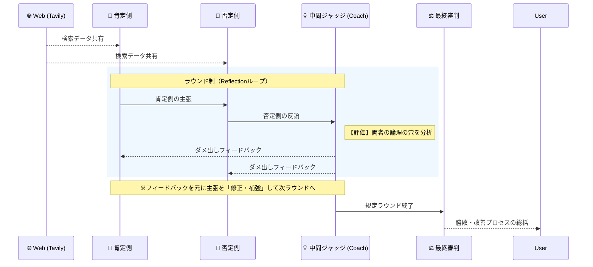

# LangGraphの「Reflectionパターン」で、AI同士のディベートを急激に進化させる拡張ガイド

前回の記事では、LangGraphを用いて「肯定側」と「否定側」のAIエージェントに議論を戦わせるディベートWebアプリの基本構成をご紹介しました。
しかし前回は、**「それぞれが意見をぶつけ合い、最後に審判が勝敗を決める」**という一方通行のフローでした。

今回はそのアーキテクチャを一歩進め、最新のAIエージェント開発における重要概念である **「Reflection（自己内省）パターン」** を組み込んでみました。

これにより、議論の途中で「中間ジャッジ（コーチ）」がダメ出しを行い、そのフィードバックを元にエージェントが自身の主張を改善して再反論する、という**「成長する議論ループ」**を実現します。

---

## 💡 Reflection（自己内省）パターンとは？

AI（LLM）の出力精度を高めるための手法の一つです。
単純に「プロンプトを入れて答えを出す」のではなく、**「生成（Generate） ➡️ 評価（Critique） ➡️ 修正・再生成（Refine）」** というループを回すことで、より深く、論理破綻のない出力を得るアプローチです。

今回はこれをマルチエージェントのディベートに応用します。

## 🏛 新しいアーキテクチャ構成

前回の構成に、ラウンドの区切りで「両者の論理の甘さ」を指摘する **中間ジャッジ（Intermediate Judge）** を追加しました。

**▼ 処理フローのイメージ**


---

## 🛠 実装のポイント

### 1. State（状態）の拡張

これまでの「ターン数」ではなく、「ラウンド数」と「フィードバック」を保持するように変更しました。

```python
class DebateReflectionState(TypedDict):
    topic: str
    messages: Annotated[List[BaseMessage], add_messages]
    research_data: str
    round_count: int      # ターン数ではなく「ラウンド数」を管理
    max_rounds: int       # 最大ラウンド数
    feedback: str         # 中間ジャッジからのフィードバック
    final_judge_result: str
```

### 2. 中間ジャッジ（中間レビュアー）の導入

勝敗を決めるのではなく、**「両者の議論をより深くするための厳しいダメ出し」** を行うノードを追加します。

```python
def intermediate_judge_node(state: DebateReflectionState):
    """ラウンド終了時に両者の論理をレビューし、ダメ出しを行う"""
    llm = ChatOpenAI(model="gpt-4o-mini", temperature=0.2)
    
    system_prompt = f"""あなたは競技ディベートの「中間レビュアー（コーチ）」です。
勝敗を決めるのではなく、両者の議論をより深くするための厳しいダメ出しを行ってください。
「データ不足」「論理の飛躍」「相手の反論に答えていない点」を指摘し、次のラウンドで何を改善すべきかを明確に指示してください。"""
    
    messages = [SystemMessage(content=system_prompt)] + state["messages"]
    response = llm.invoke(messages)
    
    # Stateの feedback にダメ出し内容を保存し、ラウンドを進める
    return {
        "feedback": response.content,
        "round_count": state.get("round_count", 0) + 1
    }
```

### 3. プロンプトへの「フィードバックの動的注入」

ここがこの実装の最重要ポイントです。
肯定側・否定側エージェントのプロンプトに、**「前回の中間ジャッジからのフィードバック（存在する場合）」を動的に追加**し、それを反映して発言するように強制します。

```python
def pro_debater_node(state: DebateReflectionState):
    # (中略) 基本のシステムプロンプト定義...
    
    # ★ Reflectionパターンのキモ
    # もしStateに中間ジャッジからのフィードバックがあれば、プロンプトに追記して改善を促す
    if state.get("feedback"):
        system_prompt += f"\n【審判からのフィードバック（改善要求）】:\n{state['feedback']}\n※この指摘事項を深く受け止め、自分の論理の弱点を補強・修正した上で主張を展開してください。\n"

    messages = [SystemMessage(content=system_prompt)] + state["messages"]
    response = llm.invoke(messages)
    
    return {"messages": [AIMessage(content=f"【肯定側】\n{response.content}")]}
```

### 4. グラフのルーティング（条件付きエッジ）

「否定側」が終わった後に「中間ジャッジ」へ進み、中間ジャッジのアドバイスが終わった後に、「規定ラウンドに達したか」の条件分岐を行います。

```python
def build_reflection_debate_graph():
    workflow = StateGraph(DebateReflectionState)
    
    # (中略) ノードの追加
    
    # 通常のエッジフロー
    workflow.add_edge("researcher", "pro_debater")
    workflow.add_edge("pro_debater", "con_debater")
    workflow.add_edge("con_debater", "intermediate_judge") # 否定側の後は中間ジャッジへ
    
    # 条件分岐: 中間ジャッジのフィードバック後、どちらへ進むか
    workflow.add_conditional_edges(
        "intermediate_judge",
        should_continue, # ラウンド数を確認する関数
        {
            "pro_debater": "pro_debater", # ラウンド継続（フィードバックを元に再戦）
            "final_judge": "final_judge"  # 規定ラウンド終了（最終ジャッジへ）
        }
    )
    
    workflow.add_edge("final_judge", END)
    return workflow.compile()
```

---

## � ハルシネーション（嘘）を防ぐための追加実践テクニック

 Reflectionループを回すと、LLMが「議論に勝ちたい」と焦るあまり、**もっともらしい嘘（架空のデータ）をでっち上げてしまう**というハルシネーション問題に直面することがあります。これを防ぐためにいくつかのアプローチを組み合わせています。

### 1. 検索データの「整形」と「出典の強制」
`Tavily` が返してくる生のJSON辞書をそのまま渡すのではなく、`[出典 1] タイトル \nURL: ...\n内容: ...` というLLMが極めて読みやすいテキストに整形（Data Formatting）して渡します。
その上で、ディベーターのプロンプトに**「引用・参照する場合は、必ず文中に [出典 1] のように参照元を明記してください」**と指示することで、「データ元になければ語れない」という制約をかけます。

### 2. 強い禁止制約（Negative Prompting）
**「【ハルシネーション（捏造）の絶対禁止】 主張の根拠は、必ず【リサーチデータ】に記載されている事実のみを使用してください」** と強く釘を刺します。

### 3. 中間ジャッジによる「ファクトチェック」
コーチ役の中間ジャッジにも【リサーチデータ】をあわせて渡し、「両者の主張がリサーチデータに基づいているか確認し、データにない架空の数値を語っている場合は厳しく指摘しろ」というファクトチェックの役割を追加します。これにより、万が一嘘をついても次のラウンドで確実に潰されます。

---

## �🚀 実行結果（Reflectionの威力）

実際にこのコードをターミナルで実行してみると、以下のような劇的な変化が見られます。

**第1ラウンド：**
お互いにリサーチデータに基づく「教科書通り」の一般的なメリット・デメリットを主張し合います。

**中間ジャッジのダメ出し（フィードバック）：**
> *「肯定側は『経済効果がある』と主張したが、具体性が不足している。データに基づく数値を提示せよ。」*
> *「否定側は『格差が広がる』と反論したが、肯定側の経済成長のロジックを直接否定できていない。どう格差に直結するかの道筋を示せ。」*

**第2ラウンド：**
中間ジャッジの叱咤激励を受けた両者は、**第1ラウンドよりも明らかに一段深い、具体的な数値やデータを用いた鋭い議論**を展開し始めます。ただの言い返しではなく、指摘された「自陣の弱点」をカバーしようとする動きが見られます。

---

## 💡 まとめ

LangGraphを用いると、このような「自律的な改善ループ（Reflection）」も、Stateの追加とEdgeのつなぎ替えだけで非常にシンプルに実装できました。

LLM単体ではどうしても出力が浅くなってしまう・ハルシネーションが起きてしまうタスクでも、「別のLLMに評価（Critique）させ、その結果を取り込んで再生成させる」アーキテクチャを組むことで、出力品質は飛躍的に向上させることができます。

コーディング支援エージェント（提案 ➡️ 実行 ➡️ エラー評価 ➡️ コード修正）など、ディベート以外の分野でも強力に機能するパターンなので、ぜひ皆さんのプロジェクトのアーキテクチャ設計にも取り入れてみてください。
