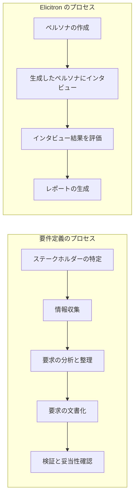

```mermaid
graph LR
    %% 図 10.2 要件定義のプロセスと、Elicitron のプロセスの比較

    subgraph "要件定義のプロセス"
        A[ステークホルダーの特定] --> B[情報収集]
        B --> C[要求の分析と整理]
        C --> D[要求の文書化]
        D --> E[検証と妥当性確認]
    end

    subgraph "Elicitron のプロセス"
        F[ペルソナの作成] --> G[生成したペルソナにインタビュー]
        G --> H[インタビュー結果を評価]
        H --> I[レポートの生成]
    end
```